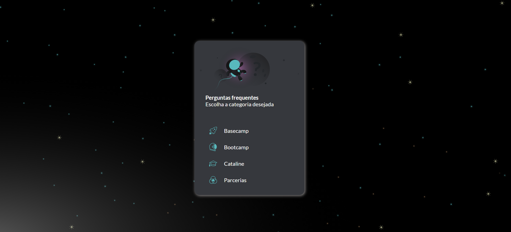

# Desafio Vuex Cataline

Neste desafio o objetivo era construir uma paginação simples utilizando o gerenciador de estados Vuex



Você pode conferir o resultado clicando [AQUI](https://desafio-cataline.netlify.app/)

Recomendo a plataforma pois o instrutor possui uma didática muito boa, além das animações que são muito feras.

[Site da Cataline](https://www.cataline.io/)
  

## Project setup

```

npm install

```

  

### Compiles and hot-reloads for development

```

npm run serve

```

  

### Compiles and minifies for production

```

npm run build

```

  

### Lints and fixes files

```

npm run lint

```

  

### Customize configuration

See [Configuration Reference](https://cli.vuejs.org/config/).
